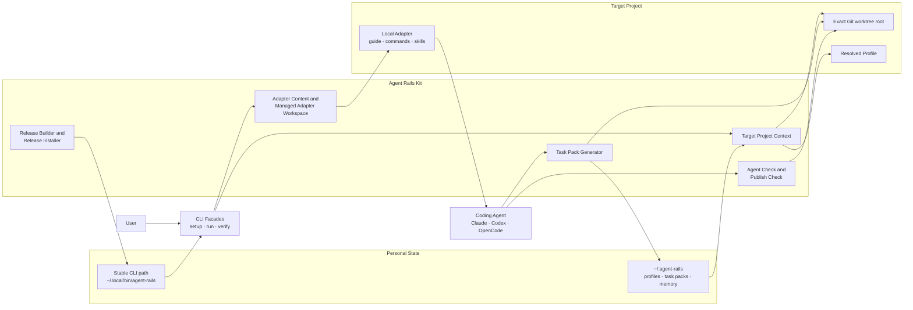
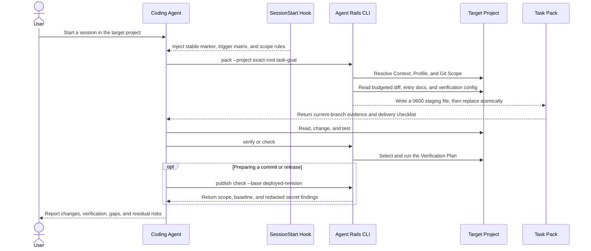
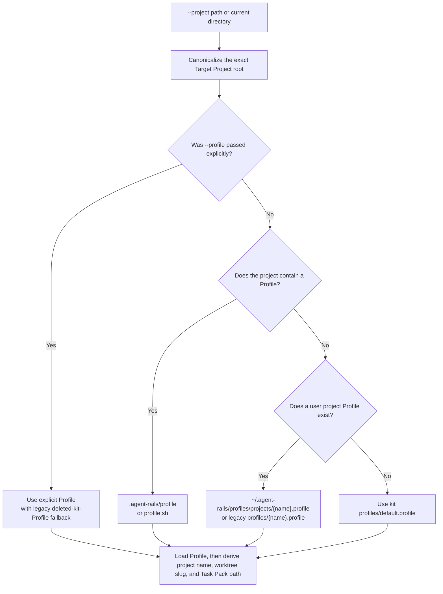
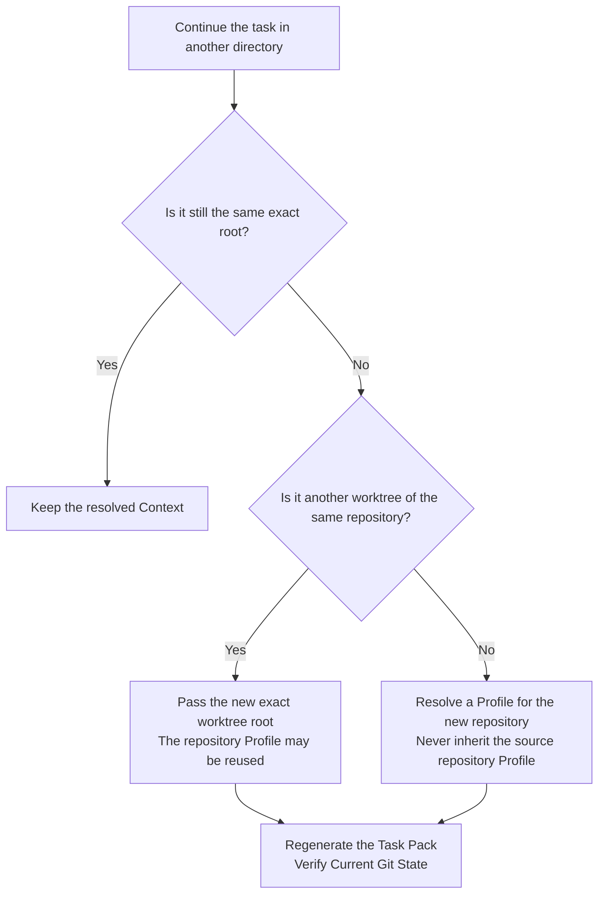
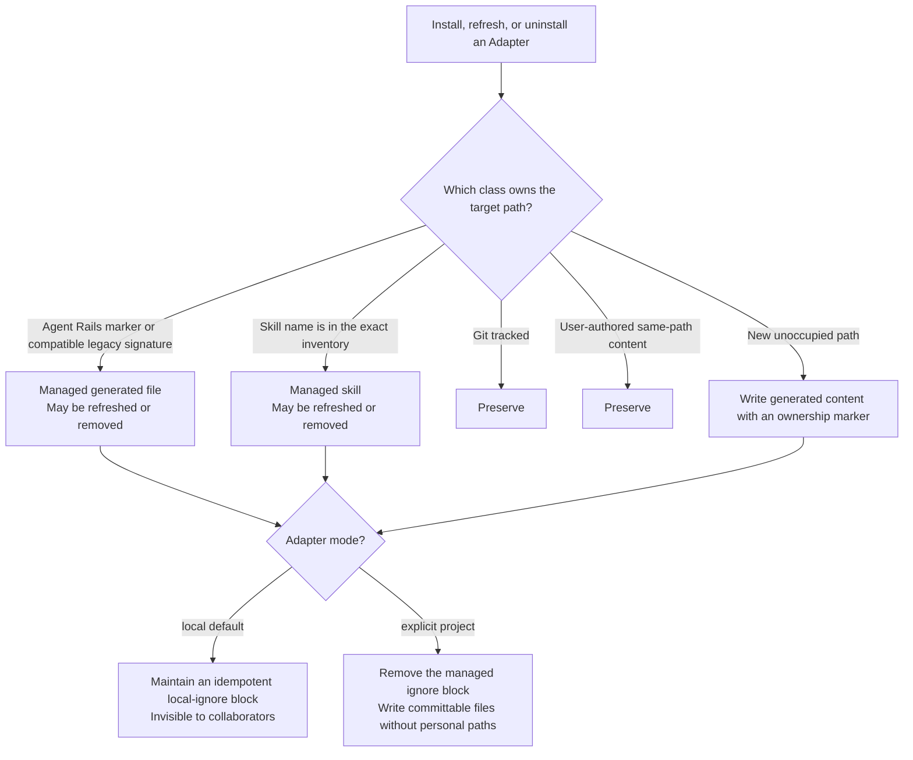
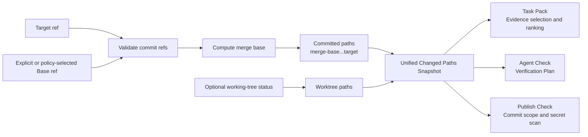
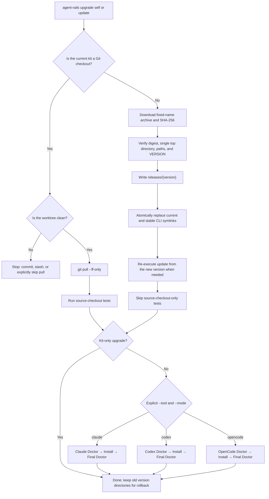

# How Agent Rails Works

[简体中文](./how-agent-rails-works.zh-CN.md) | [English](./how-agent-rails-works.en.md)

Agent Rails is not another coding agent and does not take ownership of a business repository. It is a personal workflow guardrail between an agent and a target project: it makes the target, scope, and evidence explicit before work starts, then makes verification, commit scope, and release scope explicit before delivery.

This document explains the complete operating model. See the [English CLI Reference](./cli-reference.en.md) for commands and [Design and Safety Boundaries](./local-adapters-and-release-safety.md) for individual design decisions.

## Core Design

Agent Rails follows five principles:

1. **Separate the kit from the target project.** The kit supplies reusable capabilities; a business repository is only the Target Project being read or changed.
2. **Separate stable rules from task evidence.** SessionStart injects short, stable routing rules. An on-demand Task Pack carries branch, diff, documentation, and memory evidence.
3. **Resolve target identity before doing task work.** Every entrypoint first resolves the exact project root, Profile, worktree identity, and Task Pack path, preventing context from leaking across repositories or worktrees.
4. **Require ownership for generated artifacts.** An Adapter refreshes or removes only files and skills that Agent Rails can prove it manages. Tracked and user-authored content is preserved by default.
5. **Verify before publishing or switching versions.** Git scope, sensitive output, Release validation, and atomic switching all use fail-closed semantics.

## System Architecture

| Layer | Owns | Does not own |
| --- | --- | --- |
| CLI facades | Orchestrate `setup`, `run`, and `verify` over existing modules | Duplicated domain implementations |
| Target Project Context | Canonical target root, resolved Profile, project name, worktree slug, and Task Pack path | Automatic Profile propagation to another repository |
| Adapter modules | Tool-specific entrypoints, managed files, skill inventories, and local ignores | Content whose ownership cannot be proven |
| Task Pack | Budgeted target, Git, documentation, memory, and verification evidence | Unbounded repository or sensitive context in a prompt |
| Check / Publish Check | Verification selection, commit and publish scope, and likely-secret findings | Committing, pushing, or publishing on the user's behalf |
| Release modules | Complete kit bundles, validation, and installed-version switching | Target Project or Adapter ownership rules |

## Lifecycle of One Task

A full context is not generated at startup because a session may perform only a fixed read operation. The agent chooses the smallest useful path for the task:

| Path | Use it for | Output |
| --- | --- | --- |
| Deep Pack | Cross-subproject, contract or schema changes, migrations, refactors, ambiguous product work | Full Task Pack with bounded evidence |
| Lite Pack | POCs, deployment preparation, focused continuation | More compact Task Pack |
| Check-only | Releasing, uploading, or final validation from an existing branch | Verification Plan and scope report |
| Skip | Fixed read-only work with no repository-scope risk | Explicit skip reason |

This split keeps SessionStart stable and lets a Task Pack be regenerated whenever the target, branch, or goal changes, without trusting stale session memory.

## Target Project and Profile Isolation

Target Project Context is the common starting point for the main entrypoints. It canonicalizes any nested directory to the exact Git worktree root, then resolves a Profile in a fixed order.

Target changes follow a separate isolation rule:

A directory basename cannot prove repository identity. Isolation therefore depends on an explicit root and the resolution flow, not a simple folder-name comparison.

## Adapter Ownership Model

Adapters connect Agent Rails to different coding-agent tools. The default `local` mode is personal: it uses the target repository's `.git/info/exclude` and does not modify the team's `.gitignore`. After validation, explicit `project` mode promotes the same managed artifacts into portable, committable team files.

`local → project` is the formal promotion path; switching back restores local ignores. `--force` is an explicit repair choice, not the automatic update default. `update` follows the ownership-aware refresh path; `doctor --fix` can repair damaged managed content.

## Git Scope, Verification, and Publish Evidence

`pack`, `check`, and `publish check` share Git Scope resolution so the three entrypoints do not develop different meanings for “what changed.”

Project checks try `origin/main`, `origin/master`, `main`, and `master` in order. Publish checks additionally prefer the current upstream, but an upstream is only a source-control baseline; it does not prove what is deployed. When a deployment delta cannot be established, the report marks `Deployment delta: UNRESOLVED` and requires the currently deployed revision explicitly.

Sensitive-output behavior is also purpose-specific. Task Packs favor conservative redaction. Publish Check scans only added committed, staged, and unstaged lines plus complete untracked text, then reports only the location and evidence needed for a decision. Base64 and URL encoding are never treated as redaction.

## How GitHub Release Updates Work

Agent Rails is a multi-file shell kit, so a Release distributes a complete archive instead of a wrapper that still depends on a source directory. The CLI distinguishes a Git checkout from a Release Install using its own resolved location.

The Release Installer finishes downloading and validating before it switches anything. Any checksum, archive-layout, version, or user-owned non-symlink path error stops the operation. Project maintenance requires one explicit tool, so a historical default cannot refresh the wrong Adapter. See [GitHub Release Distribution](./github-release-distribution.md) for the full asset and rollback contract.

## Consistency and Failure Semantics

| Situation | Guarantee |
| --- | --- |
| Target path is missing or its Profile cannot load | Fail before reading project evidence |
| Target/base ref is invalid or has no merge base | Do not produce a misleading empty-scope report |
| Task Pack rendering fails | Preserve the old file and print no success; staging permissions are `0600` |
| Adapter cannot prove file ownership | Preserve the file by default |
| Publish baseline cannot represent deployed state | Mark it `UNRESOLVED`; do not claim release readiness |
| Release checksum, structure, or version does not match | Do not switch `current` |
| Stable CLI or `current` is a regular file | Treat it as user-owned and refuse replacement |

Together, these rules enforce one outcome: Agent Rails may do less, but it must not present incomplete evidence as safe completion.

## Explicit Non-Goals

- It does not commit, push, merge, or create a Release on the user's behalf.
- It does not commit Agent Rails files to a business repository by default.
- It does not store access keys, cookies, or tokens in the kit.
- It does not require online memory; online memory is only an optional read provider for Task Packs.
- It does not guess sibling-repository configuration from the current session's Profile.
- It does not describe SHA-256 as signing or supply-chain attestation.

## Code Map

| Concern | Implementation entrypoint |
| --- | --- |
| CLI routing | [`bin/agent-rails`](../bin/agent-rails) |
| Target Project Context | [`scripts/agent-target-project.sh`](../scripts/agent-target-project.sh) |
| Profiles and personal paths | [`scripts/agent-paths.sh`](../scripts/agent-paths.sh) |
| SessionStart | [`hooks/agent-rails-session-start.sh`](../hooks/agent-rails-session-start.sh) |
| Task Pack | [`scripts/agent-context-pack.sh`](../scripts/agent-context-pack.sh) |
| Git Scope | [`scripts/agent-git-scope.sh`](../scripts/agent-git-scope.sh) |
| Verification and publish check | [`scripts/agent-check.sh`](../scripts/agent-check.sh), [`scripts/agent-publish-check.sh`](../scripts/agent-publish-check.sh) |
| Adapter ownership | [`scripts/agent-adapter-workspace.sh`](../scripts/agent-adapter-workspace.sh) |
| Update and Release install | [`scripts/agent-update.sh`](../scripts/agent-update.sh), [`scripts/agent-release-install.sh`](../scripts/agent-release-install.sh) |
