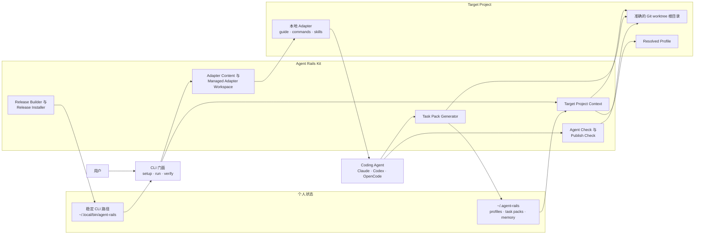
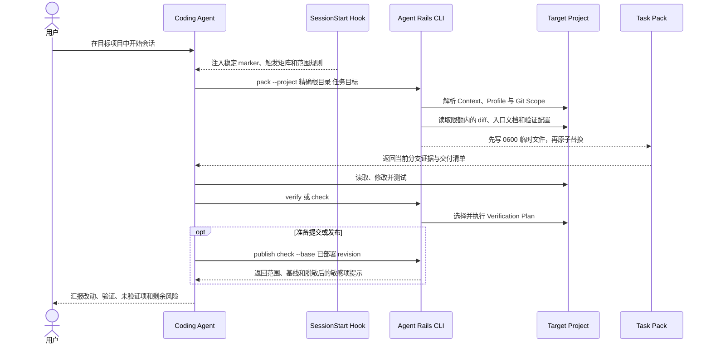
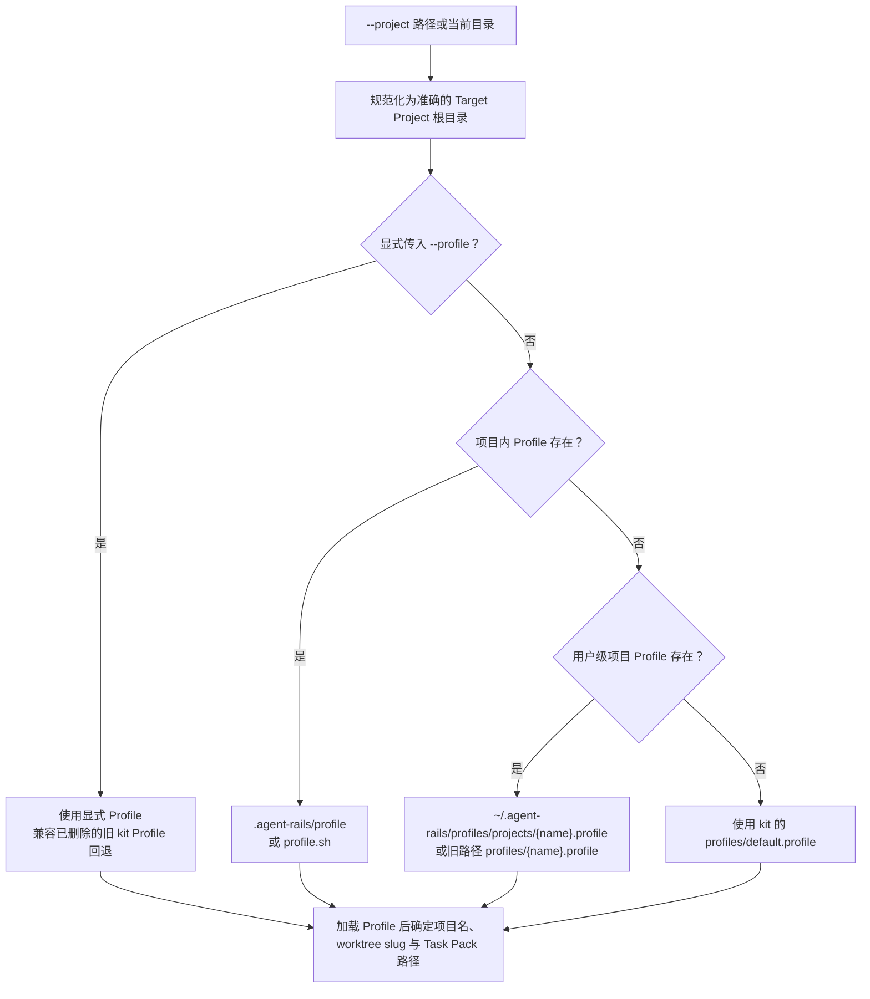
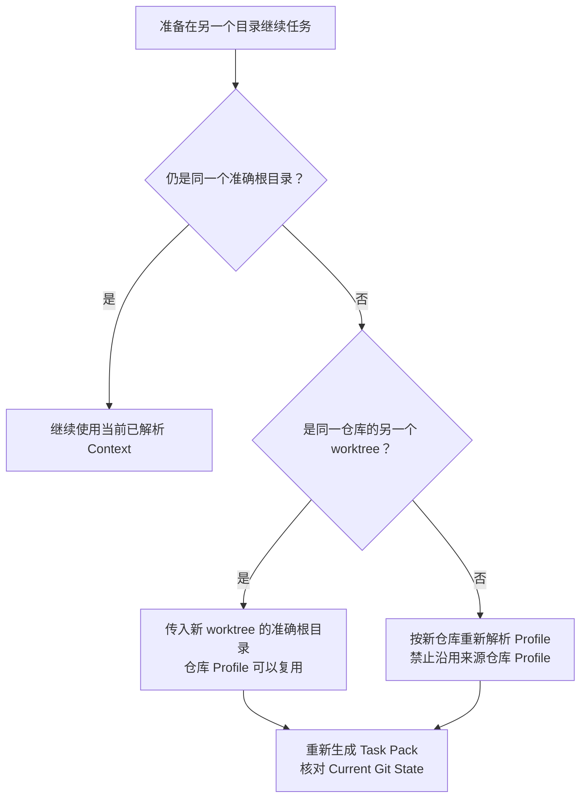
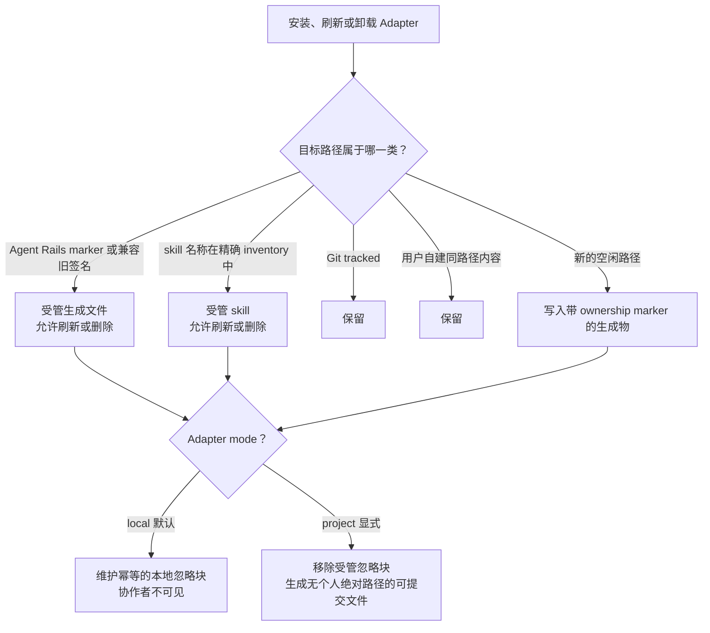
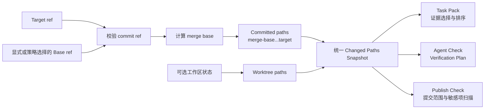
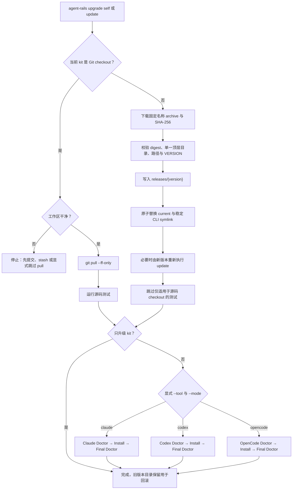

# Agent Rails 工作原理

[简体中文](./how-agent-rails-works.zh-CN.md) | [English](./how-agent-rails-works.en.md)

Agent Rails 不是另一个 coding agent，也不接管业务仓库。它是运行在 agent 与目标项目之间的一层个人工作流护栏：先确认目标、范围和证据，再让 agent 开始工作；交付前再把验证、提交和发布范围显式化。

本文解释整体运行机制。命令参数见 [中文 CLI 参考](./cli-reference.zh-CN.md)，具体安全决策见 [设计与安全边界](./local-adapters-and-release-safety.md)。

## 核心设计

Agent Rails 遵循五个原则：

1. **Kit 与目标项目分离。** Kit 提供可复用能力，业务仓库只是被读取和操作的 Target Project。
2. **稳定规则与任务证据分离。** SessionStart 只注入短小、稳定的路由规则；分支、diff、文档和 memory 等任务证据由按需 Task Pack 提供。
3. **目标身份先于任务执行。** 每个入口先解析准确的项目根目录、Profile、worktree 标识和 Task Pack 路径，避免跨仓库或跨 worktree 串用上下文。
4. **生成物必须有所有权。** Adapter 只刷新或删除 Agent Rails 能证明由自己管理的文件和 skill；tracked 或用户自建内容默认保留。
5. **发布与更新先验证再切换。** Git 范围、敏感输出、Release 校验和原子切换都采用 fail-closed 语义。

## 系统结构

| 层 | 负责什么 | 不负责什么 |
| --- | --- | --- |
| CLI 门面 | 把 `setup`、`run`、`verify` 编排到已有模块 | 不复制底层业务逻辑 |
| Target Project Context | 规范化目标根目录，解析 Profile、项目名、worktree slug 和 Task Pack 路径 | 不把当前 Profile 自动传播给另一个仓库 |
| Adapter 模块 | 生成工具专用入口并维护受管文件、skill 清单和本地忽略 | 不覆盖无法证明所有权的内容 |
| Task Pack | 在预算内组装目标、Git、文档、memory 和验证证据 | 不把整个仓库或敏感上下文无界塞进 prompt |
| Check / Publish Check | 选择验证计划，展示提交和发布范围，扫描可能的敏感信息 | 不替用户提交、推送或发布 |
| Release 模块 | 构建完整 kit 包，校验并切换已安装版本 | 不改变 Target Project 或 Adapter 的所有权规则 |

## 一次任务的生命周期

启动时不生成完整上下文，因为会话可能只做一次只读查询。agent 根据任务选择最小路径：

| 路径 | 适用场景 | 产物 |
| --- | --- | --- |
| Deep Pack | 跨子项目、契约或 schema 变化、迁移、重构、歧义需求 | 完整但有预算上限的 Task Pack |
| Lite Pack | POC、部署准备、聚焦续作 | 更紧凑的 Task Pack |
| Check-only | 使用现有分支做发布、上传或最终验证 | Verification Plan 和范围报告 |
| Skip | 与仓库范围无关的固定、只读操作 | 明确的跳过原因 |

这种拆分让 SessionStart 保持稳定，也让 Task Pack 能在目标、分支或任务变化后重新生成，而不依赖旧会话记忆。

## Target Project 与 Profile 隔离

Target Project Context 是所有主要入口的共同起点。它先把任意子目录规范化为准确的 Git worktree 根目录，再按固定优先级解析 Profile。

目标切换遵循下面的隔离规则：

目录 basename 不能证明仓库身份，所以隔离依赖显式根目录和解析流程，而不是简单比较文件夹名称。

## Adapter 的所有权模型

Adapter 把 Agent Rails 接入不同 coding-agent 工具。默认 `local` 是个人集成：使用目标仓库的 `.git/info/exclude`，不会修改团队 `.gitignore`。验证有效后可显式选择 `project`，把同一套受管生成物提升为 portable、可提交的团队文件。

`local → project` 是正式的推广路径；反向切换会重新建立本地忽略。`--force` 是显式修复选择，不是自动更新的默认行为。`update` 走所有权感知的刷新路径；损坏的受管内容可由 `doctor --fix` 修复。

## Git Scope、验证与发布证据

`pack`、`check` 和 `publish check` 共享一套 Git Scope 解析，避免三个入口各自理解“改了什么”。

项目检查默认依次尝试 `origin/main`、`origin/master`、`main`、`master`。发布检查会优先考虑当前 upstream，但 upstream 只代表源码基线；它不能证明线上实际部署了什么。无法建立部署增量时，报告会标记 `Deployment delta: UNRESOLVED`，需要显式传入当前已部署 revision。

敏感信息策略也按用途分层：Task Pack 以保守脱敏为主；Publish Check 只扫描新增的 committed、staged、unstaged 行以及完整 untracked 文本，并只输出定位和决策所需信息。Base64 或 URL 编码从不视为脱敏。

## GitHub Release 更新原理

Agent Rails 是多文件 shell kit，因此 Release 分发完整 archive，而不是只分发一个仍依赖源码目录的 wrapper。CLI 根据自身所在位置区分 Git checkout 与 Release Install。

Release 安装器在切换前完成下载和校验；任何 checksum、archive layout、版本或用户自有非 symlink 路径异常都会停止。项目维护必须显式选择一种工具，因此不会因为历史默认值误刷 Claude Adapter。更完整的资产与回滚契约见 [GitHub Release 分发设计](./github-release-distribution.md)。

## 一致性与失败语义

| 场景 | 保证 |
| --- | --- |
| 目标路径不存在或 Profile 无法加载 | 在读取项目证据前失败 |
| target/base ref 无效或没有 merge base | 不生成误导性的空范围报告 |
| Task Pack 渲染失败 | 不替换旧文件，也不打印成功；临时文件权限为 `0600` |
| Adapter 无法证明文件所有权 | 默认保留该文件 |
| Publish baseline 不能代表部署状态 | 标记 `UNRESOLVED`，不宣称 release-ready |
| Release checksum、结构或版本不匹配 | 不切换 `current` |
| 稳定 CLI 或 `current` 是普通文件 | 视为用户所有并拒绝覆盖 |

这些规则共同实现一个目标：Agent Rails 可以少做，但不能用不完整证据假装已经安全完成。

## 明确的非目标

- 不替用户提交、推送、合并或创建 Release。
- 不把 Agent Rails 文件默认提交到业务仓库。
- 不在 kit 中保存 AccessKey、cookie 或 token。
- 不把在线 memory 当作必需依赖；它只作为 Task Pack 的可选读取 provider。
- 不用当前会话的 Profile 猜测 sibling 仓库配置。
- 不把 SHA-256 描述成签名或供应链证明。

## 代码导航

| 关注点 | 实现入口 |
| --- | --- |
| CLI 路由 | [`bin/agent-rails`](../bin/agent-rails) |
| Target Project Context | [`scripts/agent-target-project.sh`](../scripts/agent-target-project.sh) |
| Profile 与个人路径 | [`scripts/agent-paths.sh`](../scripts/agent-paths.sh) |
| SessionStart | [`hooks/agent-rails-session-start.sh`](../hooks/agent-rails-session-start.sh) |
| Task Pack | [`scripts/agent-context-pack.sh`](../scripts/agent-context-pack.sh) |
| Git Scope | [`scripts/agent-git-scope.sh`](../scripts/agent-git-scope.sh) |
| 验证与发布检查 | [`scripts/agent-check.sh`](../scripts/agent-check.sh)、[`scripts/agent-publish-check.sh`](../scripts/agent-publish-check.sh) |
| Adapter 所有权 | [`scripts/agent-adapter-workspace.sh`](../scripts/agent-adapter-workspace.sh) |
| 更新与 Release 安装 | [`scripts/agent-update.sh`](../scripts/agent-update.sh)、[`scripts/agent-release-install.sh`](../scripts/agent-release-install.sh) |
