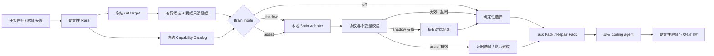

# Agent Rails Local Brain 设计

> 状态：设计评审稿。本文只确定产品行为与实现边界，Local Brain 运行代码尚未开发。

## 1. 背景

Agent Rails 的北极星目标不是提升模型的内生智力，而是在相同模型、相同云端 token
预算和相同任务环境下，通过检索、拆解、约束与反馈闭环提高 coding agent 的任务
成功率。

当前确定性 Rails 已经能够：

- 从固定 Git target 中检索少量任务相关的实现与验证位置；
- 在 dirty snapshot 中保留 changed evidence，并补充尚未触碰的实现/测试入口；
- 在验证失败后生成有界 Repair Pack，并根据错误重新检索相关位置；
- 通过 Git Scope、Sensitive Output Guard、Verification Plan 和 Publish Check 保持
  事实、安全与交付约束。

这些能力擅长提供可靠候选和阻止严重错误，但静态评分不能理解所有语义。例如，同一个
任务可能匹配多个名字相近的实现，错误信息也可能同时指向症状位置和根因位置；主
coding agent 也可能不知道此刻更适合使用 `agent-diagnose`、`agent-tdd`、Code Evidence
还是 Verification Plan。Local Brain 的作用是在 Rails 已经建立的安全候选和真实能力
范围内做更好的取舍，而不是替代 Rails、执行完整 agent loop 或直接操作项目。

## 2. 产品定位

Local Brain 是 Agent Rails 的可选本地决策 Implementation。

它遵循四条原则：

1. **Rails 拥有事实**：Git target、候选文件、代码片段、失败诊断、验证结果和安全规则
   都由确定性 Module 读取和校验。
2. **Brain 只做决策**：本地模型可以排序、选择、分类，或者建议回到确定性路径；它不
   获得 shell、文件写入、Git mutation、发布或验证裁决能力。
3. **Host 拥有副作用**：任何读取都由 Rails 在固定快照上执行；任何后续动作仍由现有
   Agent Rails Interface 或上层 coding agent 完成。
4. **Catalog 拥有能力事实**：Brain 只看 Rails 冻结的 Capability Catalog；“知道某项
   skill/tool 存在”不等于获得调用权，也不等于它在当前宿主中可用。

Local Brain 不是新的 coding agent，也不是第二套运行时。没有配置它时，Agent Rails
必须保持当前完整能力；配置后服务不可用或响应不合规时，也必须自动回退到同一套
确定性结果。

## 3. 总体流程



关键点是模型永远接触不到“执行命令”这一分支。它只能在 Rails 提供的数据结构内返回
一个受限决策，返回值也只有通过确定性校验后才可能影响证据顺序，或向主 coding agent
显示一个不可自动执行的 capability 建议。

## 4. 运行模式

| 模式 | 是否调用本地模型 | 是否影响 Task/Repair Pack | 失败行为 | 用途 |
| --- | --- | --- | --- | --- |
| `off` | 否 | 否 | 不适用 | 默认模式与可靠兜底 |
| `shadow` | 是 | 否 | 保留确定性结果 | 观察协议、稳定性和决策差异 |
| `assist` | 是 | 影响允许的证据选择或增加能力建议 | 自动回退确定性结果 | 实际辅助 coding agent |

首版不提供 `required` 模式。Local Brain 不是任务完成的硬依赖，模型服务故障不能阻断
Pack、Run 或 Verify。

`shadow` 不是一次性 POC，而是实际运行模式：它用于升级模型、修改 prompt 或更换本地
服务时先观察行为，再切换到 `assist`。

## 5. 首版功能范围

Local Brain 的长期能力按“输入已收窄、输出可枚举、结果可校验”选择：

| 方面 | Brain 决策 | Rails / 主 coding agent 的责任 | 阶段 |
| --- | --- | --- | --- |
| 任务识别 | 识别 bug、重构、评审、发布准备，以及定位/修改/验证/修复阶段，用于选择下一步 | Rails 的 Trigger Matrix 和安全规则仍是硬约束 | 首版 |
| 能力选择 | 从 confirmed available capability 中推荐一个 skill/tool intent | 主 agent 决定是否执行；Brain 不生成命令 | 首版 |
| 代码证据 | 重排实现、测试和支持位置，选择最值得先读的证据 | Rails 固定快照、读取、脱敏和角色约束 | 首版 |
| 失败纠偏 | 重排失败相关证据，建议诊断、验证或回退/升级方向 | Verify 保留退出码并判定成功失败 | 第二阶段 |
| 验证建议 | 在确定性 Verification Plan 中建议优先验证的类别 | 主 agent 执行，Rails 解释结果 | 第二阶段 |
| Memory 参与 | 重排只读卡片；验证成功后建议是否形成 Memory Candidate | Curator 决策并显式写本地卡片，Brain 不写 Memory | 第二阶段 |
| 成本与升级 | 建议下一轮证据密度、继续检索、询问用户或交给更强模型 | Rails 控制硬预算、调用次数和回退 | eval 后 |

首版聚焦前三项。它们的共同特点是适合小模型做短分类、排序和有限选择，不要求 1B
模型完成长链 coding、证明根因或生成可执行计划。

### 5.1 Capability Catalog 与下一步建议

Local Brain 必须了解当前 Agent Rails 可以帮助主 coding agent 做什么，但得到的是一个
有界能力目录，不是 tool schema 或可执行句柄。

Capability Catalog Module 冻结三类事实：

1. **Rails 原生能力**：Task Pack、Code Evidence、Memory read、Verification Plan、
   Agent Check、Repair Pack、Doctor 等稳定 Interface；
2. **Agent Rails skills**：kit 中经过审核的 skill 蓝图，以及 Claude/OpenCode 受管
   inventory 或显式 skills install 能确认的已安装状态；
3. **宿主 tools**：只有 Codex、Claude 或 OpenCode Adapter 能提供版本化、可信的当前
   tool snapshot 时才进入 Catalog；无法确认的动态 MCP、browser 或第三方 tool 不猜测。

首版不通过读取自由文本 SKILL.md 临时推断能力。kit 增加一份版本化、机器可读的
capability registry，保存稳定用途、intent、副作用与成本；契约测试保证 registry 与
当前 15 个 skill 蓝图及需要暴露的公共 Rails Interface 不漂移。受管 inventory 只负责
证明某个 skill 是否已安装，不重新定义其含义。

当前 skill 基线按职责分为：

- 上下文与计划：`agent-run-loop`、`agent-context-pack`、`agent-grill`；
- coding 工作流：`agent-diagnose`、`agent-tdd`、`agent-refactor`、`agent-review`；
- 验证与接入诊断：`agent-check`、`agent-doctor`；
- 配置与扩展：`agent-profile-init`、`agent-claude-adapter`、`agent-skill-author`；
- Memory：`agent-memory-curator`、`agent-memory-suggest`；
- 协作交接：`agent-subagent-result`。

原生 Rails capability 基线包括 Task Pack、Code Evidence、Memory read、Verification
Plan、Agent Check、Repair Pack、Doctor 和 Publish Check。Catalog 以 registry 为准，
本文列表只用于设计评审。

每项 capability 只包含：

- 稳定 ID，例如 `skill:agent-diagnose`、`rail:code-evidence`；
- `rail`、`skill` 或 `host-tool` 类型；
- 一句话用途与允许的 intent 枚举；
- `available`、`unknown` 或 `unavailable` 状态，以及状态证据来源；
- `read`、`execute`、`write-local`、`write-project`、`network` 等副作用标签；
- `cheap`、`normal` 或 `heavy` 成本等级；
- 固定的 `recommend-only` 权限。

Catalog 不包含命令文本、参数、原始 SKILL.md 正文、完整 tool schema、endpoint、凭证或
宿主环境。kit 中存在蓝图但没有安装证据时标为 `unknown`，Brain 不能把它推荐成当前可用
能力。

这个 Module 通过删除测试：如果删除它，availability、effect、cost、intent 和 registry
校验会分别泄漏到 Brain Host、Doctor、Task Pack 与各 Adapter；集中后，调用方只消费一
个冻结 Catalog，获得更高 Depth、Leverage 和 Locality。首版不建立通用 host-tool
provider Seam；等至少一个具体宿主 Adapter 能产出真实 snapshot 后再设计，并在第二个
Implementation 出现时确认共享 Seam。

Brain 可以处理 `choose_next_capability` 决策：在当前目标、Git/失败阶段和已知能力中选择
一个 capability ID 与受限 intent。`assist` 只把经过校验的建议显示给主 coding agent；
Rails 不执行它。主 agent 仍根据自己的工具权限、用户授权和任务上下文决定是否调用。

为降低 1B 模型的协议负担，一次 Brain request 只做一种决策：能力选择与代码证据重排
不会混在一个响应中。

### 5.2 Task Code Evidence 重排

确定性 Code Evidence 先从固定 target 中建立一个比最终 Pack 槽位略大的候选池。每个
候选包含：

- 不透明候选 ID；
- tracked relative path；
- implementation、verification 或 support 角色；
- 行号与轻量符号；
- 确定性匹配原因；
- Rails 从同一 target 读取、截断并脱敏的局部代码片段。

Brain 返回最终候选 ID 的有序子集。它不能添加新路径、修改行号或返回代码正文。

确定性不变量仍然有效：当候选池同时存在 implementation 和 verification，且预算至少为
2 时，最终结果必须保留两种角色。响应违反该约束时整次 Brain 决策失效，而不是由 Host
猜测如何修补模型输出。

### 5.3 Repair Code Evidence 重排

Verify 失败后，Repair Pack 仍由 Rails 选择首个高价值诊断，并从冻结验证 target 中
检索候选。Brain 只负责判断哪些候选更值得下一轮优先阅读。

它不能：

- 宣称根因已经确认；
- 更改原始验证退出码或成功/失败状态；
- 省略失败命令和确定性诊断；
- 要求执行新的命令；
- 读取 worktree-only 或 untracked 内容。

### 5.4 可观测状态

Task Pack 和 Repair Pack 只显示对 coding agent 有用的简短状态，例如：

- `Brain: off`
- `Brain: shadow (agreement)`
- `Brain: assist (accepted)`
- `Brain suggestion: skill:agent-check (recommend-only)`
- `Brain: assist (fallback: timeout)`

不向 Pack 展开模型 reason、prompt、原始 JSON、推理过程或服务错误。`shadow` 的完整
对比记录仅在显式启用 trace 时写入用户级私有目录，不进入 Target Project，也不成为
Memory 卡片。

### 5.5 Doctor

Doctor 负责检查：

- mode 是否为 `off`、`shadow` 或 `assist`；
- 启用 Brain 时是否配置 Adapter command；
- timeout 和输出上限配置是否合法；
- Capability Catalog 是否能区分 available、unknown 和 unavailable；
- 可选 smoke 是否能完成一次不含项目源码的协议往返。

Doctor 不打印 Adapter stderr、模型原始响应、prompt 或凭证环境。

## 6. 受控读取模型

首版不向模型暴露通用读取工具。Rails 根据确定性候选预取局部片段，相当于模型通过一个
固定、单向的只读 Interface 获得代码证据：

- 只读 `target_sha:path`，不读当前 worktree；
- 只允许 Git tracked regular blob；
- 单 blob、单片段、候选数和总字符都有硬上限；
- 只读取匹配行或符号周围的完整行窗口；
- 进入请求前经过 Sensitive Output Guard；
- 路径、正文和诊断都作为 JSON 数据，不参与 prompt 指令拼接。

这样已经满足“模型可以读取并做决策”，但读取动作由 Rails 代办，模型没有文件系统句柄。

后续只有在首版证据不足反复出现时，才增加一次受控 follow-up read：模型可请求已知候选
ID 的另一段行窗口，Rails 校验后最多执行一个批次，再要求模型给出最终决策。不会开放
任意路径读取、递归探索或无界工具循环。

## 7. Brain Adapter Seam

Agent Rails 核心只认识一个版本化的 stdin/stdout JSON Interface。具体模型服务协议由
外部 Adapter Implementation 拥有。

建议配置：

```bash
AGENT_RAILS_BRAIN_MODE=off
AGENT_RAILS_BRAIN_CMD='/path/to/local-brain-adapter'
AGENT_RAILS_BRAIN_TIMEOUT_SECONDS=8
```

模型名、MLX/Ollama/llama.cpp/OpenAI-compatible URL、量化方式和 prompt 模板都属于
Adapter，不进入 Agent Rails Profile 的核心协议。这样可以替换 MiniCPM5-1B-MLX 或
其他本地模型，而不让 kit 依赖某个推理框架。

首个官方 Adapter Implementation 面向 loopback OpenAI-compatible 服务。Host 使用
argv 直接启动 Adapter，不经过 shell parser，也不把 Target Project Profile 导出的任意
环境传给它；非敏感的 endpoint 和 model 通过 Adapter 参数配置。它只完成：

1. 从 stdin 读取 Brain request；
2. 调用本地 HTTP endpoint；
3. 要求模型输出严格 JSON；
4. 将响应 JSON 原样写到 stdout。

官方 Adapter 默认拒绝非 loopback endpoint，不发送 Authorization header，不访问文件
系统，也不给模型注册 tools。第三方 Adapter 是用户信任的本地可执行程序；Agent Rails
可以限制它的输入、输出和生命周期，但不能声称在没有操作系统 sandbox 的情况下阻止
恶意可执行程序写文件。

## 8. JSON 契约

### 8.1 Request

`choose_next_capability` 示意结构：

```json
{
  "schema_version": "agent-rails-brain-request/v1",
  "request_id": "sha256:...",
  "decision": "choose_next_capability",
  "context": {
    "project": "agent-rails",
    "target_sha": "012345...",
    "goal": "修复验证失败后的相关代码定位",
    "failure": "optional bounded diagnostic"
  },
  "evidence_summary": {
    "stage": "after_change",
    "changed_paths": 3,
    "verification_failed": false
  },
  "capabilities": [
    {
      "id": "skill:agent-check",
      "kind": "skill",
      "purpose": "select related verification",
      "intents": ["verify_related_changes"],
      "availability": "available",
      "availability_source": "managed-inventory",
      "effects": ["execute"],
      "cost": "normal",
      "authority": "recommend-only"
    }
  ]
}
```

`request_id` 由 canonical request 数据计算，用来绑定响应并支持重放；它不是会话 token。

### 8.2 Response

```json
{
  "schema_version": "agent-rails-brain-response/v1",
  "request_id": "sha256:...",
  "action": "recommend",
  "capability_id": "skill:agent-check",
  "intent": "verify_related_changes",
  "reason": "已有改动，应先运行相关验证"
}
```

`choose_next_capability` 的 `action` 只允许：

- `recommend`：返回 Catalog 中一个 `available` capability 与其允许的 intent；
- `fallback`：不增加 Brain 建议，继续使用现有 Task Pack 和确定性 Verification Plan。

`rank_code_evidence` 使用同一个 envelope，但 payload 是候选和角色约束，响应 `action`
只允许：

- `select`：使用返回的有序候选；
- `fallback`：模型主动要求使用确定性结果。

`reason` 是有长度上限的简短可解释说明，不要求也不保存 chain-of-thought。

响应必须满足：

- UTF-8 且只有一个 JSON object；
- schema version 和 request ID 精确匹配；
- 字段集合、类型、枚举和长度全部合法；
- candidate ID 已知、唯一且不超预算；
- capability ID 必须来自当前 Catalog、状态为 `available`，intent 必须属于该能力；
- required roles 不被破坏；
- 没有 command、path、content、tool call 或任意扩展动作字段。

两个 decision 使用各自的严格 validator：能力建议响应不能携带 candidate 字段，证据
重排响应也不能携带 capability 字段。

任一条件失败都触发完整确定性回退。

## 9. 安全与资源约束

Brain Host 的最低约束：

- 默认 `off`；
- 请求只包含完成当前决策所需的字段；
- 不传 AccessKey、cookie、token、完整 Profile 环境或 Git remote URL；
- source excerpt 和 failure diagnostic 始终是不可信数据；即使其中包含 prompt injection，
  模型也只能返回受限候选 ID 或 capability ID，不能把其转换成工具调用或 Host 指令；
- skill/tool 名称与说明也经过 Catalog 规范化；第三方原始描述和 schema 不直接进入 Brain
  request，避免 capability metadata 成为 prompt injection 通道；
- Adapter stderr 永不进入用户输出；
- stdout 流式读取并有小型硬上限；
- 总 deadline 有硬上限；
- Adapter 运行在独立进程组，超时、超量和完成后都清理子孙进程；
- JSON 解析失败、未知 schema 和未知字段一律失败关闭；
- 模型 `reason` 只进入可选私有 trace，不重新注入 Task Pack 或 coding agent 上下文；
- Brain 错误不能改变 Pack/Verify 的既有成功与失败语义；
- trace 使用 `0600` 原子写入用户级 Agent Rails 目录，不写 Target Project；
- trace 再次经过敏感输出策略，并允许完全关闭。

模型输出永远是“不可信决策数据”，不是指令。

## 10. 确定性回退

以下情况都使用 Brain 调用前冻结的确定性选择：

- mode 为 `off`；
- command 未配置或不能启动；
- 本地服务连接失败；
- deadline 或输出上限触发；
- 非 UTF-8、非 JSON 或 schema 不匹配；
- request ID 不匹配；
- 未知/重复候选、超预算或角色不变量被破坏；
- 推荐了 unknown/unavailable capability，或返回了 Catalog 未允许的 intent；
- Sensitive Output Guard 无法安全构造请求；
- 内部出现任何未预期异常。

回退必须复用已计算的候选，不能为了“再试一次模型”重新打开可移动 Git ref，也不能
自动进行第二次网络调用。

## 11. 成本模型

Local Brain 的目标是降低完整 coding session 成本，而不是单独追求 Pack 更短或本地
推理次数更多。

成本由五部分组成：

1. Rails 本地 Git 读取与脱敏；
2. 本地模型推理延迟、内存和电力；
3. 发给上层云模型的总输入 token；
4. coding agent 的文件读取与工具调用；
5. 首次失败后的修复轮数。

加入 Brain 后，第 1、2 项会增加；只有第 3～5 项出现更大下降，且任务成功率不降低，
才算净收益。简单任务可能持平或略慢，因此 Brain 不能成为所有任务的无条件默认路径。

后续 eval 至少记录：

- deterministic 与 Brain 的候选差异；
- capability 推荐、主 agent 是否采用，以及采用后的任务阶段结果；
- Task Pack token 与完整 session provider token；
- 文件读取数、工具调用数和重复读取；
- 首次修改通过率与修复轮数；
- 最终确定性验收结果；
- Brain 首 token/总耗时、超时率和回退率；
- 本地模型与 Adapter 版本。

评测成熟前不宣称百分比收益，也不因为本地推理“免费”就忽略延迟和资源占用。

## 12. 实现切片

### Slice 1：Capability-aware Task Pack 纵向 tracer bullet

- 新增 Brain request/response 类型和严格 validator；
- 外部 command Adapter 的 deadline、输出上限和进程组管理；
- 提供只访问 loopback OpenAI-compatible 服务的官方 Adapter；
- 新增 Capability Catalog Module，先覆盖 Rails 原生能力和已有受管 skill inventory；
- 新增机器可读 registry，并用契约测试对齐 15 个 skill 蓝图和公开 Rails 能力；
- 让 Brain 在一个 `choose_next_capability` request 中选择 available capability 与 intent；
- `assist` 在 Task Pack 中显示 recommend-only 建议，但不执行任何 skill/tool；
- `off`、`shadow`、`assist` 贯通 Profile、Task Pack 和最小 Doctor 诊断；
- 任一失败回到现有 Task Pack/Verification Plan，不新增建议；
- 覆盖 Catalog availability、协议、超时、洪泛、子进程与 Pack 集成测试。

第一刀结束时必须能用真实本地模型服务为主 coding agent 生成一个经过 Rails 校验、不可
自动执行的能力建议；不能只留下尚无消费者的 Host 或抽象 Interface。

### Slice 2：Task Code Evidence 重排

- 确定性候选池与最终槽位分离；
- 从冻结 target 读取有界、脱敏的局部片段；
- Brain 选择通过约束后只影响 Task Code Evidence 顺序和子集；
- 能力选择与证据重排保持两个独立 decision request；
- 任一失败自动回退到冻结的确定性候选。

### Slice 3：Shadow trace 与运行诊断

- 私有、可关闭、`0600` 的 deterministic/Brain 对比 trace；
- Doctor 协议 smoke 和不泄露 Adapter 输出的故障诊断；
- Brain accepted/fallback 的短状态，不展开 prompt 或原始响应；
- trace 数量和总大小的有界保留策略。

### Slice 4：Repair Pack

- 复用同一 Brain Interface 重排失败相关候选；
- 保留原始失败诊断、退出状态和确定性回退；
- 不引入自动修复循环或验证裁决。

### Slice 5：Verification 与 Memory 参与

- 只从现有 Verification Plan 中推荐验证类别，不生成或执行命令；
- 对 Rails 已安全选出的只读 Memory 卡片做相关性重排；
- 仅在确定性验证成功后提出 Memory Candidate 信号，不调用写入 Interface；
- Memory Curator 和 Memory Suggest 继续拥有价值判断与显式本地写入。

### Slice 6：宿主能力快照与本地模型兼容性

- 只有宿主 Adapter 能真实枚举时，才增加 Codex/Claude/OpenCode host-tool snapshot；
- MiniCPM5-1B-MLX 作为首个实际候选模型；
- 不依赖模型原生 tool calling，统一要求严格 JSON；
- 提供 MLX/Ollama/llama.cpp 的配置示例，但不把其 SDK 依赖加入 base install。

### Slice 7：Eval、受控 follow-up read 与启用策略

- 先基于真实 trace 完善 paired eval；
- 验证能力建议是否被采用，以及 Brain 是否降低总 token、读取和修复轮数；
- 只有重复证据证明首版预取不足时，才增加一次有界 follow-up read；
- 只有稳定出现成功率或质量/token Pareto 信号，才讨论更复杂的决策。

## 13. 验收标准

功能验收：

- 默认配置不调用 Brain，`off` 的 Pack 关键内容与当前版本一致；
- `assist` 能通过真实本地服务改变允许范围内的候选顺序；
- `assist` 只能推荐 Catalog 中 available、recommend-only 的 capability 和合法 intent；
- `shadow` 调用服务但不改变 Pack 选择；
- Brain 不可用时 Pack、Run、Verify 仍正常完成；
- Task Pack 和 Repair Pack 使用同一 Brain Interface；
- Doctor 能发现配置错误并执行安全 smoke。

安全验收：

- 模型没有 shell、写文件、Git mutation、测试执行或发布 Interface；
- Capability Catalog 不包含命令、参数、完整 tool schema 或原始第三方说明；
- 未跟踪/worktree-only 内容、凭证环境和 Adapter stderr 不进入请求或 Pack；
- 超时、输出洪泛和后台子进程都被有界清理；
- 恶意 JSON 不能注入路径、候选、命令或 Markdown 结构；
- trace 不进入业务仓库，权限为 `0600`。

回归验收：

- Brain Module、Adapter、Code Evidence、Repair Pack 和 Doctor 各有直接模块测试；
- Related Test Selection 能只运行受影响套件；
- 每个实现切片运行相关测试，阶段交付运行全量回归；
- built Release smoke 包含 Brain `off` 路径，Brain 依赖不成为基础安装必需项。

## 14. 明确非目标

- 不让本地模型直接执行 shell 或编辑文件；
- 不让本地模型判定测试是否成功；
- 不建立第二套 autonomous agent loop；
- 不在首版开放任意路径读取或通用工具调用；
- 不让 Brain 自动调用它推荐的 skill/tool，也不让它生成命令或参数；
- 不让 Brain 绕过 Git Scope、Sensitive Output、Verification 或 Publish Check；
- 不因为接入本地模型就默认增加多 agent、MCTS 或多候选 patch；
- 不把 Brain trace 自动写成 Memory；
- 不让 Brain 绕过 Memory Curator 直接创建、更新或合并卡片；
- 不在没有 eval 证据前默认启用 `assist`。

## 15. 本次评审需要确认的决策

1. 首版加入 Capability Catalog，让 Brain 从 Rails 原生能力和已确认安装的 skills 中为
   主 coding agent 推荐一个下一步 capability，但永远不自动执行。
2. 能力建议和 Task/Repair Code Evidence 重排是两种独立 decision request，一次调用只
   解决一个问题，不让 1B 模型同时输出复杂计划。
3. kit-only skill 标为 `unknown`；只有 managed inventory 或宿主快照确认后才标为
   `available`。动态 host tools 无可靠快照时不猜测。
4. 首版聚焦任务识别、能力建议和代码证据重排；Verification 建议与只读 Memory 参与在
   第二阶段加入，且不获得执行或写入权。
5. 首版由 Rails 预取固定 target 的有界脱敏片段，模型没有文件系统工具；受控 follow-up
   read 等有真实不足证据后再加。
6. 保留 `off`、`shadow`、`assist` 三种模式，不提供硬依赖模型的 `required`。
7. 核心只稳定 JSON/process Interface；模型服务、模型名和 prompt 由外部 Adapter
   Implementation 拥有。
8. MiniCPM5-1B-MLX 是首个本地候选，但不是写死的产品依赖；首版官方 Adapter 对接
   loopback OpenAI-compatible 服务。
9. eval 延后到运行功能稳定后完善，但从第一刀开始保留 request ID、回退原因和可选私有
   trace，避免以后无法测量。
